# FireSupport IA - Frontend Web

**Dev 3:** Frontend Web  
**Stack:** React + Vite  
**Rama de trabajo:** `dev3-frontend`  
**Sprint 1:** 12/05/2026 - 19/05/2026  
**Sprint 2:** 20/05/2026 - 26/05/2026  
**Sprint 3:** 28/05/2026 - 02/06/2026  
**Sprint 4:** 04/06/2026 - 09/06/2026  

FireSupport IA es una plataforma web orientada a facilitar la gestión de campañas, donaciones y reportes para compañías de bomberos en Perú.

Este repositorio contiene el avance del frontend web desarrollado con React + Vite, integrando rutas públicas, rutas administrativas, paneles por rol y vistas especializadas para el flujo de donaciones y administración.

## Historias de Usuario

### Sprint 1

| HU | Descripción | Ruta | Estado |
| --- | --- | --- | --- |
| HU-01 | Solicitud de registro de compañía | `/solicitud-registro` | Terminado |
| HU-02 | Panel Super Admin de solicitudes | `/admin/solicitudes` | Terminado |
| HU-03 | Registro de donante | `/registro` | Terminado |
| HU-04 | Login de donante | `/login` | Terminado |
| HU-05 | Listado de campañas activas | `/campanas` | Terminado |

### Sprint 2

| HU | Descripción | Ruta | Estado |
| --- | --- | --- | --- |
| HU-07 | Crear y gestionar campañas | `/admin/campaigns` | Terminado |
| HU-08 | Realizar donación | `/campaign/:id` | Terminado |
| HU-09 | Comprobante de donación | `/donation/success/:id` | Terminado |
| HU-10 | Ver donaciones virtuales | `/admin/donations` | Terminado |
| HU-11 | Registrar ingresos en efectivo | `/admin/cash-income` | Terminado |
| HU-12 | Gestionar cuentas de bomberos internos | `/admin/users` | Terminado |
| HU-13 | Acceso bombero interno | `/admin/firefighter` | Terminado |

### Sprint 3

| HU | Descripción | Ruta | Estado |
| --- | --- | --- | --- |
| HU-14 | Gestionar asociaciones vinculadas | `/admin/associations` | Terminado |
| HU-15 | Acceso para administrador de asociación | `/login` | Terminado |
| HU-16 | Gestionar campañas de compañías vinculadas | `/association/campaigns` | Terminado |
| HU-17 | Gestionar roles y permisos | `/admin/roles` | Terminado |
| HU-18 | Rechazar solicitudes de compañías | `/admin/solicitudes` | Terminado |
| HU-19 | Historial de donaciones | `/historial` | Terminado |

### Sprint 4

| HU | Descripción | Ruta | Estado |
| --- | --- | --- | --- |
| HU-20 | Generador de campañas con IA | `/admin/ai-campaign-generator` | Terminado |
| HU-21 | Reportes globales del panel admin | `/admin/reports` | Terminado |
| HU-22 | Exportar reportes PDF y Excel | `/admin/report-export` | Terminado |
| HU-23 | Mi perfil y actualización de datos | `/admin/profile` | Terminado |
| HU-26 | Figura 3D Bombero e implementación de ia en campañas | Pendiente |

## Ejecución del Frontend

Instalar dependencias y levantar el servidor local:

```bash
cd frontend
npm install
npm run dev
```

Abrir en el navegador:

```text
http://localhost:5173
```

Comandos de verificación usados durante el desarrollo:

```bash
npm run lint
npm run build
```

## Integración con Backend

El frontend consume los servicios definidos en:

```text
frontend/src/services/api.js
```

La URL base se configura con `VITE_API_URL`. Para un backend local ejecutado en el puerto `3000`, la URL completa utilizada por el frontend es:

```text
http://localhost:3000/api
```

El interceptor de Axios agrega el token JWT desde `localStorage` cuando existe:

```text
Authorization: Bearer <token>
```

### Endpoints usados

| Función frontend | Endpoint |
| --- | --- |
| `solicitarRegistroCompania` | `POST /companies/request` |
| `obtenerSolicitudes` | `GET /companies/requests` |
| `aprobarSolicitud` | `POST /companies/approve` |
| `rechazarSolicitud` | `POST /companies/reject` |
| `registrarDonante` | `POST /auth/register` |
| `loginDonante` | `POST /auth/login` |
| `obtenerCampanas` | `GET /campaigns` |
| `crearCampana` | `POST /campaigns` |
| `actualizarCampana` | `PUT /campaigns/:id` |
| `crearDonacion` | `POST /donations` |
| `obtenerHistorialDonaciones` | `GET /donations/history` |
| `obtenerComprobanteDonacion` | `GET /donations/receipt/:id` |
| `obtenerDonacionesVirtuales` | `GET /campaigns/virtual-income` |
| `registrarIngresoEfectivo` | `POST /campaigns/cash-income` |
| `obtenerUsuariosCompania` | `GET /admin/users` |
| `crearUsuarioCompania` | `POST /companies/users` |
| `loginUsuarioCompania` | `POST /companies/users/login` |
| `obtenerUsuariosRoles` | `GET /admin/users` |
| `actualizarRolUsuario` | `PUT /admin/users/:id/role` |
| `desactivarUsuario` | `PUT /admin/users/:id/role` |
| `actualizarPerfil` | `PUT /users/profile` |
| `obtenerReportesGlobales` | `GET /admin/reports/global` |
| `descargarReportePDF` | `GET /admin/reports/pdf` |
| `descargarReporteExcel` | `GET /admin/reports/excel` |
| `obtenerAsociaciones` | `GET /associations` |
| `vincularAsociacion` | `POST /associations/link` |
| `desvincularAsociacion` | `DELETE /associations/unlink` |
| `loginAsociacion` | `POST /associations/login` |
| `obtenerCampanasAsociacion` | `GET /associations/campaigns` |
| `actualizarCampanaAsociacion` | `PUT /associations/campaigns/:id` |

## Rutas y Roles

Las rutas administrativas se protegen según el rol guardado en sesión.

| Rol | Acceso principal |
| --- | --- |
| `super_admin` | Solicitudes, roles, reportes globales y exportación real de reportes |
| `admin_compania` | Panel administrativo, campañas, donaciones, usuarios, asociaciones, reportes visuales y perfil |
| `admin_asociacion` | Panel de campañas de compañías vinculadas |
| `bombero` | Panel de bombero interno |
| `donante` | Donaciones e historial |

## Cambios Principales

### Sprint 2

- Se implementó la gestión administrativa de campañas con creación, edición, carga de imagen, validaciones y estados.
- Se agregó la vista pública de detalle de campaña con formulario de donación, métodos de pago y redirección a login si no existe sesión.
- Se implementó la vista de donación exitosa con comprobante, ID de transacción, método de pago, botones de PDF, imprimir y compartir.
- Se agregó el panel de donaciones virtuales con resumen, filtros por campaña y rango de fechas.
- Se agregó el panel de ingresos en efectivo con registro, edición, validaciones, confirmación y total dinámico.
- Se implementó la gestión de usuarios internos para bomberos con creación, edición, desactivación y reactivación.
- Se implementó el acceso de bombero interno y su panel con campañas asignadas, permisos y restricciones.

### Sprint 3

- HU-14: se agregó la gestión de asociaciones vinculadas para administradores de compañía.
- HU-15: se agregó el inicio de sesión para administradores de asociación y redirección protegida por rol.
- HU-16: se implementó el panel de campañas de compañías vinculadas para asociaciones.
- HU-17: se implementó la gestión de roles y permisos para Super Admin.
- HU-18: se conectó el rechazo de solicitudes de compañías con motivo obligatorio.
- HU-19: se agregó el historial de donaciones para donantes, con filtros y descarga de recibos.

### Sprint 4

- HU-20: se implementó el Generador de Campañas con IA dentro del panel admin, con formulario de configuración, validación de campos requeridos, estado de vista previa y diseño alineado al panel administrativo.
- HU-21: se implementó Reportes Globales en `/admin/reports`, con KPIs reales desde backend, ranking de campañas, filtros visuales, gráficos temporales para métricas aún no expuestas por backend y exportación PDF/Excel.
- HU-22: se implementó Exportar Reportes en `/admin/report-export`, con configuración de reporte, vista previa local, validaciones, descarga real de PDF y Excel, CSV visual no disponible e historial local de exportaciones.
- HU-23: se implementó Mi Perfil en `/admin/profile`, con edición de información personal, actualización de contraseña, dispositivos conectados, actividad reciente y preferencias de notificación.
- Se activó el acceso `Mi Perfil` desde el sidebar y desde el menú superior del avatar.
- El botón `Configuración` del menú superior queda estático por ahora.
- Se mantuvo intacta la función de cierre de sesión.

## Consideraciones Técnicas

- No se modificó backend desde el frontend.
- Las llamadas al backend real se encuentran centralizadas en `frontend/src/services/api.js`.
- Algunas secciones de Sprint 4 usan datos visuales o locales porque el backend aún no expone endpoints específicos.
- Los filtros de reportes se mantienen como UI local mientras el backend no soporte query params para esas métricas.
- La exportación PDF y Excel usa blobs reales desde backend.
- CSV se mantiene como opción visual porque aún no existe endpoint backend.
- En `Mi Perfil`, el backend solo soporta `nombre`, `email` y `password`; teléfono, ubicación, dispositivos, actividad y notificaciones se guardan localmente.
- No se agregaron librerías nuevas para las HU recientes.

## Evidencias Sprint 1

Las capturas se encuentran en:

```text
evidencias/sprint-1/
```

### HU-01 - Solicitud de Registro de Compañía

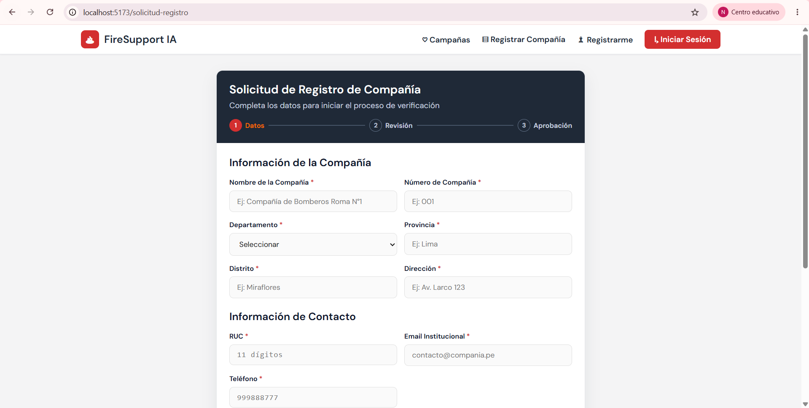

### HU-02 - Panel Super Admin

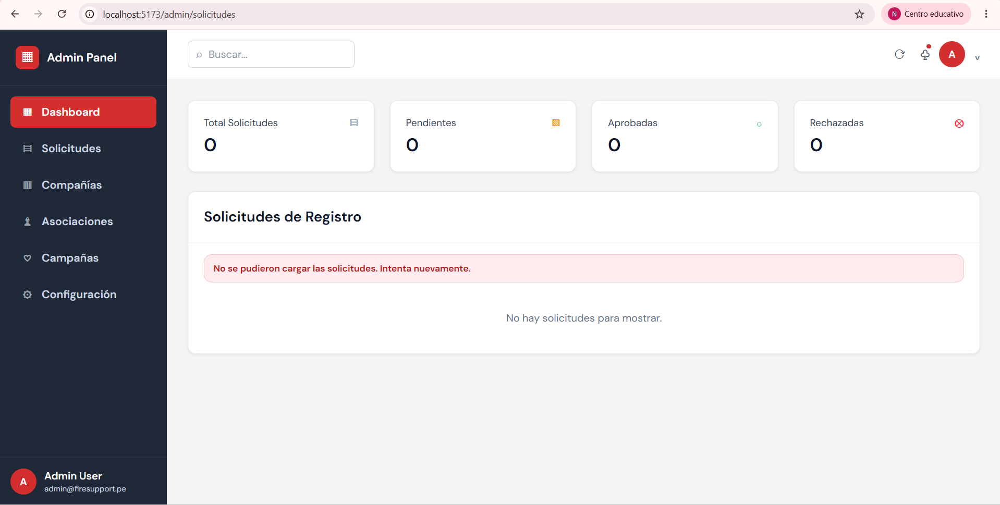

### HU-03 - Registro de Donante

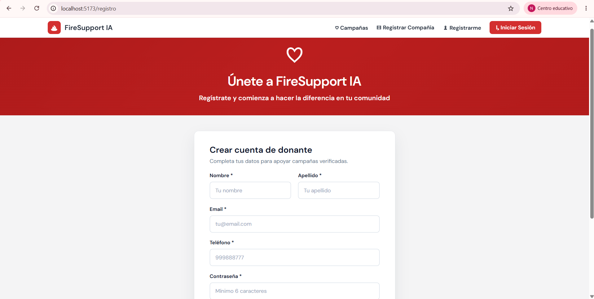

### HU-04 - Login de Donante

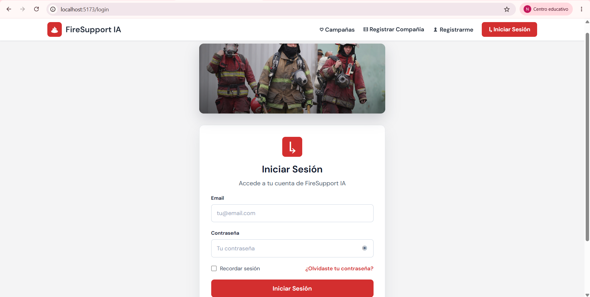

### HU-05 - Campañas Activas

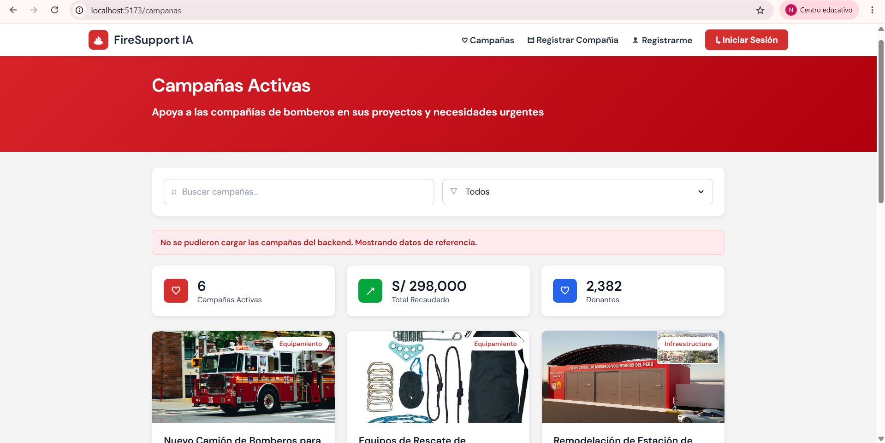

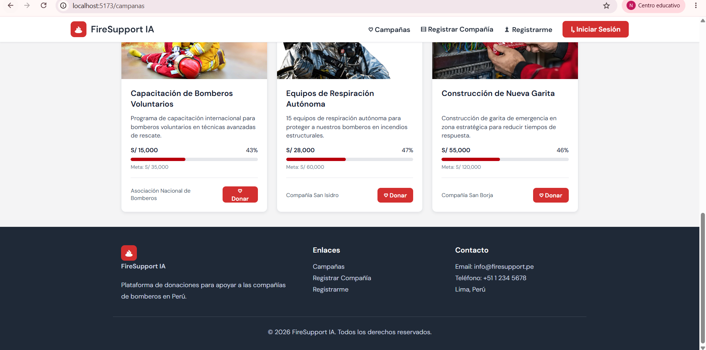

## Evidencias Sprint 2

Las capturas se encuentran en:

```text
evidencias/sprint-2/
```

### HU-07 - Gestión de Campañas

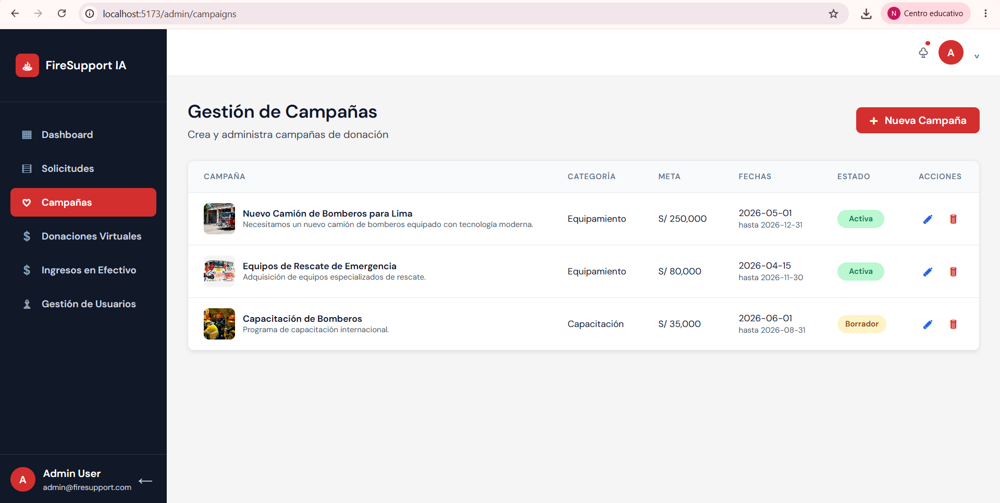

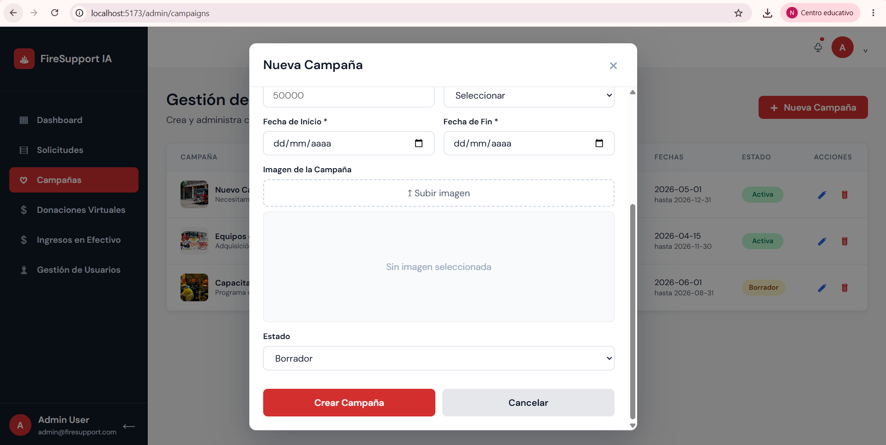

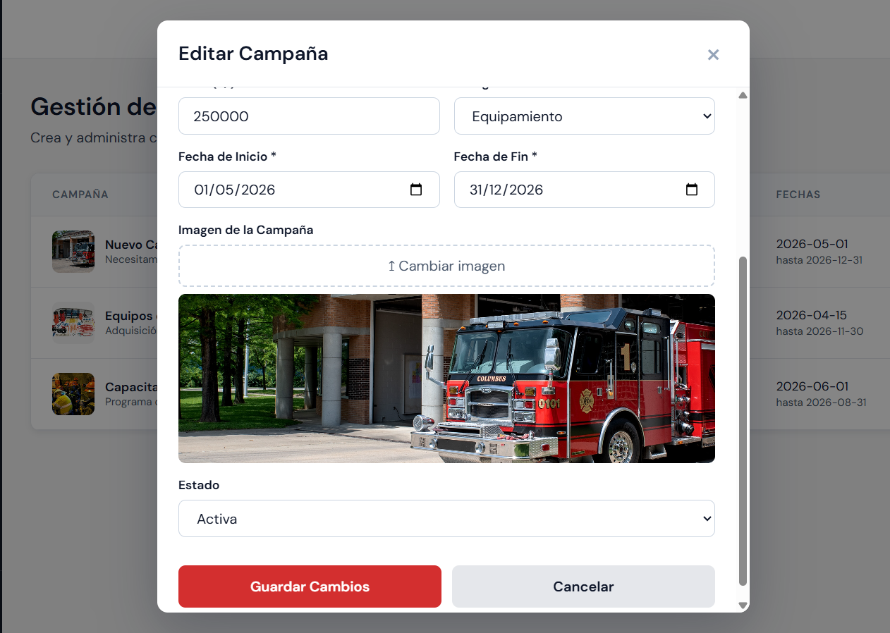

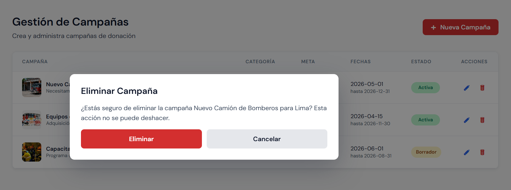

### HU-08 - Realizar Donación

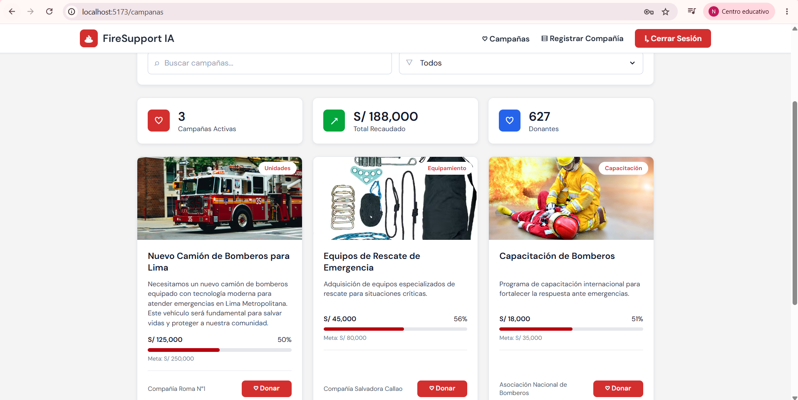

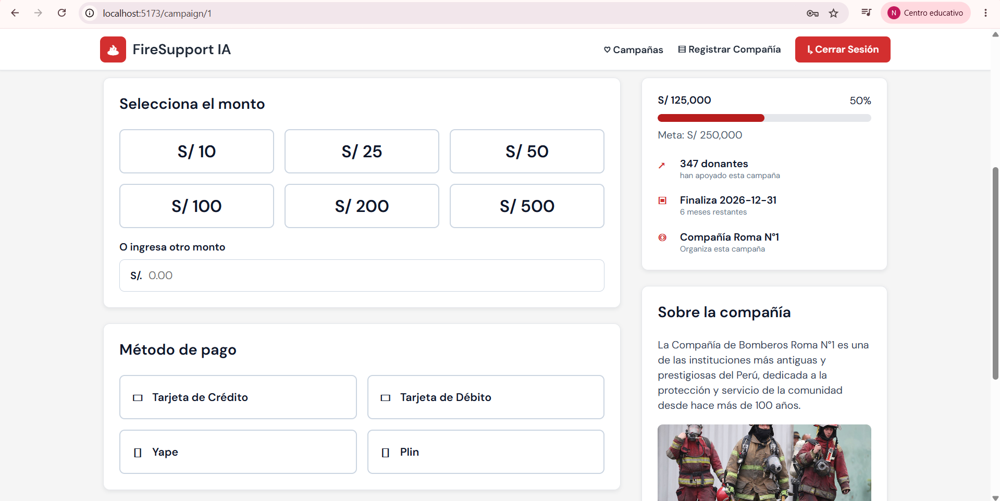

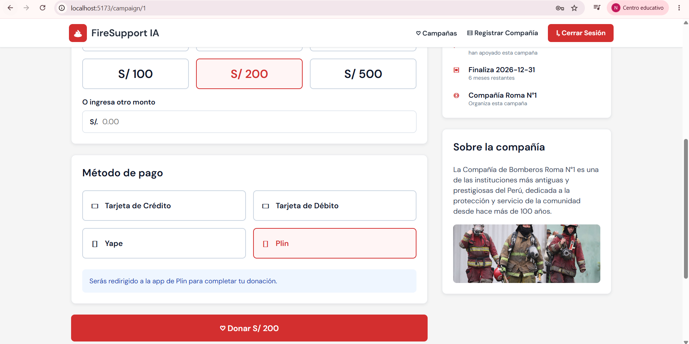

### HU-09 - Comprobante de Donación

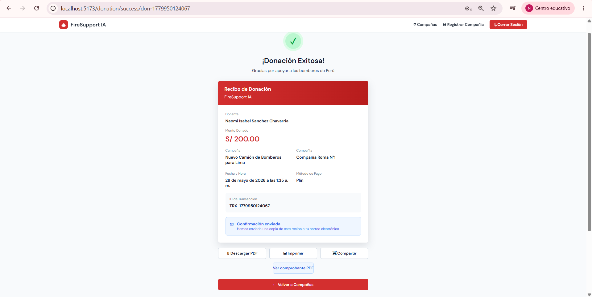

### HU-10 - Donaciones Virtuales

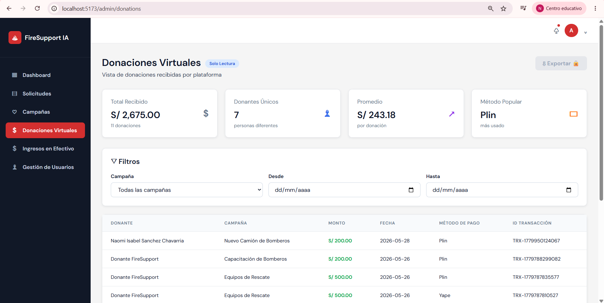

### HU-11 - Ingresos en Efectivo

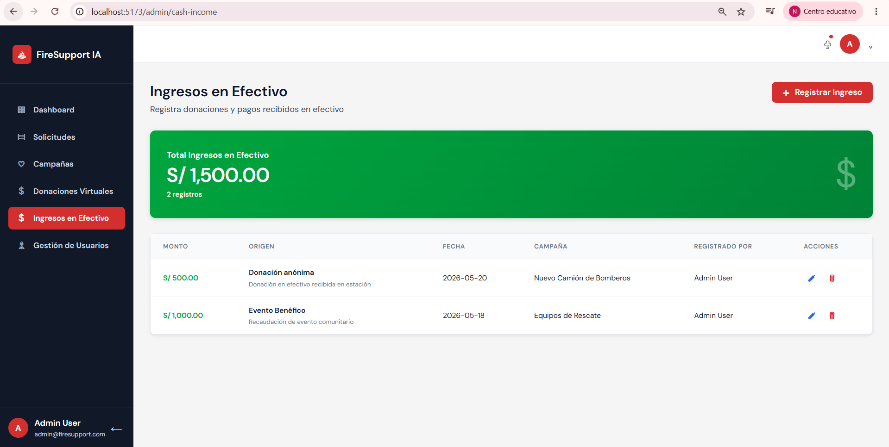

### HU-12 - Gestión de Usuarios Internos

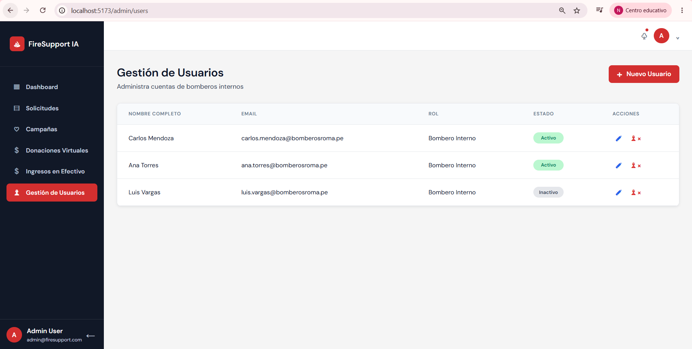

### HU-13 - Panel Bombero Interno

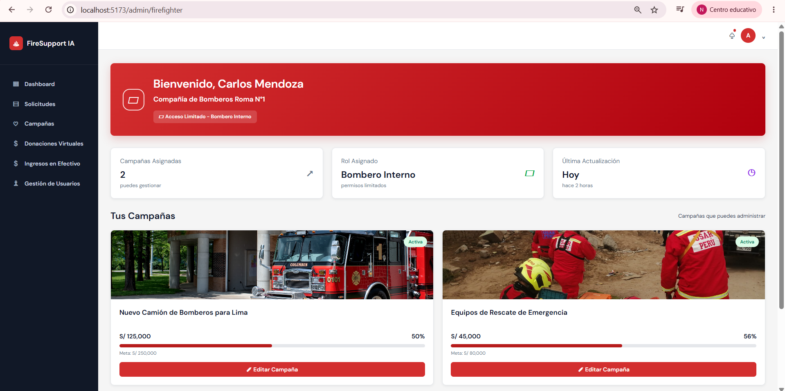

## Evidencias Sprint 3 y Sprint 4

Las evidencias del Sprint 3 y Sprint 4 se encuentran en la rama de Dev1-uiux, correspondiente al diseño UX.

## Notas Finales

- HU-26 queda en estado pendiente.
- Para probar flujos protegidos, iniciar sesión con un usuario que tenga el rol correspondiente.
- El backend debe estar disponible y `VITE_API_URL` debe apuntar correctamente al servidor.
- El diseño mantiene la identidad visual de FireSupport IA: sidebar oscuro, rojo principal, cards blancas, bordes redondeados, sombras suaves y layout responsive.
